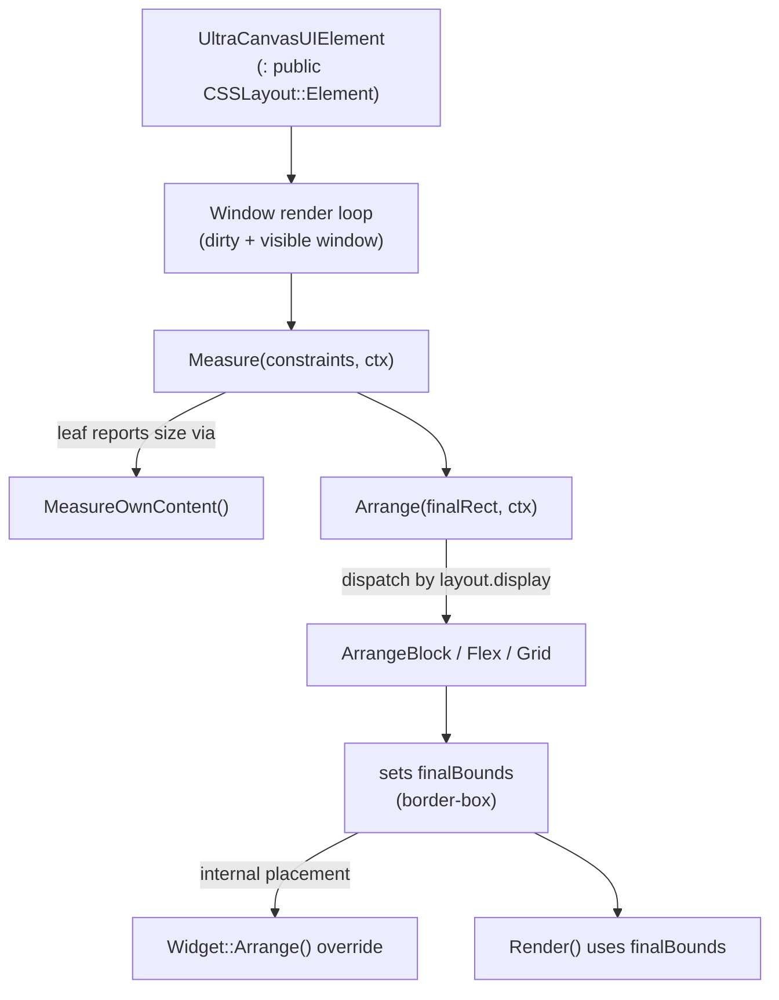
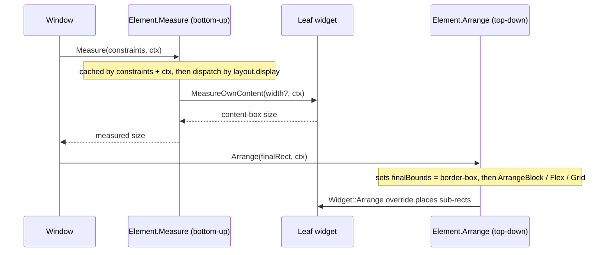

# CSS Layout in UltraCanvas

A short guide to the CSS-style layout engine (`UltraCanvas::CSSLayout`) and the contract
every UI element must follow to integrate with it.

## Overview

UltraCanvas lays out its UI with a small CSS-style layout engine living in
[CSSLayout.h](../UltraCanvas/include/CSSLayout/CSSLayout.h) and `UltraCanvas/core/CSSLayout/*.cpp`.
Every widget derives from `UltraCanvasUIElement`, which in turn derives from
`CSSLayout::Element` — so each UI element *is* a layout node. Layout runs as a **two-phase
Measure → Arrange pass**, driven once per frame from the window render loop. Widgets
describe *what they need* (intrinsic content size); the engine decides *where everything
goes* and writes the result into each element's `finalBounds`.

> **Golden rule:** UI elements must conform to the CSS layout engine — implement
> `MeasureOwnContent()` / `Arrange()` where needed and **never modify `finalBounds`
> manually**. The engine owns placement.

## Scope & limitations

The engine implements a useful subset of CSS, not the whole specification.

**Supported layout modes:**

- **Flex** (`display: flex`) — direction, wrap, grow/shrink/basis, justify/align, gap, order
- **Grid** (`display: grid`) — explicit placement, auto-placement, track sizing (px / % / fr / auto / min/max-content / fit-content), gaps
- **Block** (`display: block`, the default) — children stacked vertically
- **Absolute positioning** — `Absolute`, `Fixed`, `Relative`, and the UI-specific `AbsoluteUI`

**Not implemented yet** (do not rely on these):

- **No normal flow / inline layout.** `Inline` and `InlineBlock` fall through to Block
  (see the `TODO` at `Element.cpp:214-215`) — there is no inline formatting context, no
  text-run wrapping across boxes, no baseline alignment.
- **No table layout** (no `display: table` family).
- Minor gaps: LTR writing-mode only; no margin collapsing; Grid named lines / template
  areas / subgrid / masonry / dense packing are not implemented.

## How it integrates with the UI framework



The window calls `Measure()` then `Arrange()` on the root each frame for visible, dirty
windows (see [UltraCanvasWindow.cpp:343-350](../UltraCanvas/core/UltraCanvasWindow.cpp#L343-L350)):

```cpp
CSSLayout::MeasureConstraints mc{
    { CSSLayout::ConstraintMode::Exact, lctx.viewportWidth  },
    { CSSLayout::ConstraintMode::Exact, lctx.viewportHeight }
};
this->Measure(mc, lctx);
this->Arrange(finalBounds, lctx);
```

## The element contract — every UI element must conform

A widget participates in layout by overriding two virtual hooks declared on
`CSSLayout::Element` ([CSSLayout.h:433-436](../UltraCanvas/include/CSSLayout/CSSLayout.h#L433-L436)):

```cpp
virtual Size2Df MeasureOwnContent(std::optional<float> definiteContentWidth,
                                  const LayoutContext& ctx);
virtual void    Arrange(const Rect2Df& finalRect, const LayoutContext& ctx);
```

**1. `MeasureOwnContent()` — report intrinsic content size.**
A *leaf* widget (label, image, icon, button text) overrides this to return its own
**content-box** size, *excluding* padding and border. Pure containers don't need it — the
base returns `{0, 0}` and the engine sizes them from their children. When the engine needs
to wrap content it passes a `definiteContentWidth`; otherwise it asks for max-content
(`std::nullopt`). Example from `UltraCanvasLabel` (`UltraCanvasLabel.cpp:193-212`):

```cpp
Size2Df UltraCanvasLabel::MeasureOwnContent(std::optional<float> definiteContentWidth,
                                            const CSSLayout::LayoutContext&) {
    if (!EnsureTextLayout()) return Size2Df(0.f, 0.f);
    if (definiteContentWidth.has_value()) {           // height at a resolved width (wrapping)
        float w = std::max(0.f, *definiteContentWidth);
        textLayout->SetExplicitWidth(w);
        return Size2Df(w, (float)textLayout->GetLayoutHeight());
    }
    textLayout->SetExplicitWidth(-1);                 // max-content: natural width
    return Size2Df((float)textLayout->GetLayoutWidth(),
                   (float)textLayout->GetLayoutHeight());
}
```

**2. `Arrange()` — place internal sub-rects only.**
Override `Arrange()` *only* to lay out a widget's internal parts (e.g. a button's text and
icon) in local coordinates, **after** delegating to the base, which sets `finalBounds`.
Example from `UltraCanvasButton` (`UltraCanvasButton.cpp:842-848`):

```cpp
void UltraCanvasButton::Arrange(const Rect2Df& finalRect, const CSSLayout::LayoutContext& ctx) {
    // The engine sizes/places us (finalBounds) from the measure pass; we just
    // lay out the internal sub-rects (text/icon/split sections) in local coords.
    UltraCanvasUIElement::Arrange(finalRect, ctx);
    CalculateLayout();
}
```

**3. Do NOT modify `finalBounds` manually.**
`finalBounds` is engine-owned and written by `Arrange()`. Avoid the legacy
`SetPosition()` / `SetSize()` setters (they bypass the engine and can break layout — note
the warning at [UltraCanvasUIElement.h:218](../UltraCanvas/include/UltraCanvasUIElement.h#L218)).
Prefer `SetElementSize()` / `SetElementAbsolutePosition()`, which update the CSS properties
and let the engine recompute placement.

## The two-phase layout



- **Measure** (`Element::Measure`, `Element.cpp:187`) computes each node's content-box size
  given its constraints, bottom-up. Results are cached by constraints *and* layout context
  (viewport, font size, DPI), so unchanged subtrees are skipped.
- **Arrange** (`Element::Arrange`, `Element.cpp:241`) walks top-down, writes each node's
  border-box into `finalBounds`, and dispatches to `ArrangeBlock` / `ArrangeFlex` /
  `ArrangeGrid` to place children.

## `finalBounds` is a border-box

`finalBounds` now holds the element's **border-box** (border + padding + content;
**margin excluded**), positioned relative to the parent's border-box origin. UI elements
default to `box.boxSizing = BorderBox`
([UltraCanvasUIElement.h:141](../UltraCanvas/include/UltraCanvasUIElement.h#L141)), so an
explicit `width`/`height` describes the border-box directly.

```
   margin (NOT part of finalBounds)
 +···································+
 :  +-----------------------------+  :   <-- finalBounds = border-box
 :  |          border             |  :       (.x/.y relative to parent's
 :  |  +-----------------------+  |  :        border-box origin)
 :  |  |       padding         |  |  :
 :  |  |  +-----------------+  |  |  :
 :  |  |  |    content      |  |  |  :   <-- MeasureOwnContent() reports
 :  |  |  |   (own content) |  |  |  :       THIS box (content-box)
 :  |  |  +-----------------+  |  |  :
 :  |  +-----------------------+  |  :
 :  +-----------------------------+  :
 +···································+

 finalBounds.width  = content + padding(L+R) + border(L+R)
 finalBounds.height = content + padding(T+B) + border(T+B)
```

## Constructors & position type

UI elements expose three constructor forms. The form you pick determines the element's
CSS position type and how the engine sizes it:

| Constructor | Example | Resulting CSS layout |
| --- | --- | --- |
| `(id, x, y, w, h)` — full rect | `UltraCanvasButton("b", 10, 10, 80, 30)` | non-zero `x`/`y` ⇒ **`PositionType::AbsoluteUI`** — fixed size, placed at (x, y) |
| `(id, w, h)` — size only | `UltraCanvasButton("b", 80, 30)` | static **Block**, fixed size; engine *places* it |
| `(id)` / no size — fit-content | `UltraCanvasButton("Save")` | static **Block**, auto **fit-content** size |

**`AbsoluteUI` is a UI-specific extension, not standard CSS.** It positions exactly like
`Absolute` (against the containing block's padding-box) **but also contributes to the
container's measured size** during Measure — the container grows to cover `left+width` /
`top+height`. Plain `Absolute` keeps the standard CSS behaviour of *not* affecting the
parent's size. From [CSSLayout.h:127-131](../UltraCanvas/include/CSSLayout/CSSLayout.h#L127-L131):

```cpp
// AbsoluteUI: positioned exactly like Absolute (against the padding-box),
// but ALSO contributes to the container's measured size during Measure
// (the container grows to cover left+width / top+height). Opt-in; plain
// Absolute keeps the standard CSS behavior of not affecting parent size.
enum class PositionType   { Static, Relative, Absolute, Fixed, AbsoluteUI };
```

The full-rect constructor stamps `AbsoluteUI` **only for a real non-zero offset**
([UltraCanvasUIElement.h:144-155](../UltraCanvas/include/UltraCanvasUIElement.h#L144-L155)) —
flex/grid children are conventionally built with `(0, 0, w, h)` so they stay in flow and
the parent's algorithm can place them. Note also that an explicit `width`/`height`
**overrides** parent stretch (grid cell, `flex-grow`, `align-self: stretch`); for a widget
you want the engine to size or stretch, use the no-size constructor (or pass `0, 0`).

## Quick guidelines

- **Prefer Flex / Grid layouts over absolute positions.**
- For children of a flex/grid container, use the **no-size** (or `(0,0)`) constructor so the
  parent's algorithm sizes them; pass a fixed `w`/`h` only when you truly want a fixed box.
- For **leaf widgets**, implement `MeasureOwnContent()` to publish the content-box size.
- Override `Arrange()` only for internal sub-rect placement — call the base first.
- **Never write to `finalBounds` directly;** use `SetElementSize()` /
  `SetElementAbsolutePosition()` if you must set geometry imperatively.
- Toggle visibility with `SetVisible()` — it flows through `layout.display` (`NoDisplay`)
  and invalidates layout for you.
