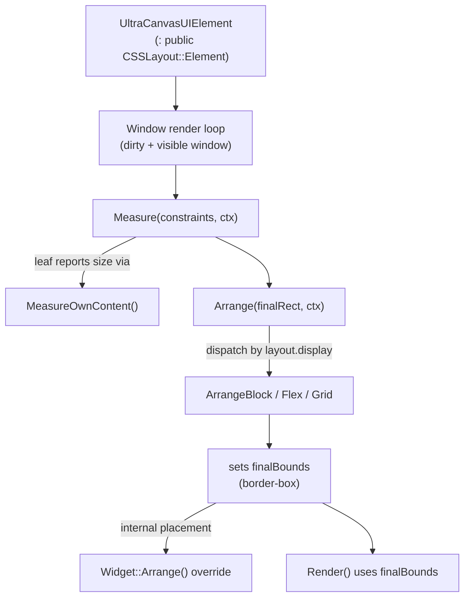
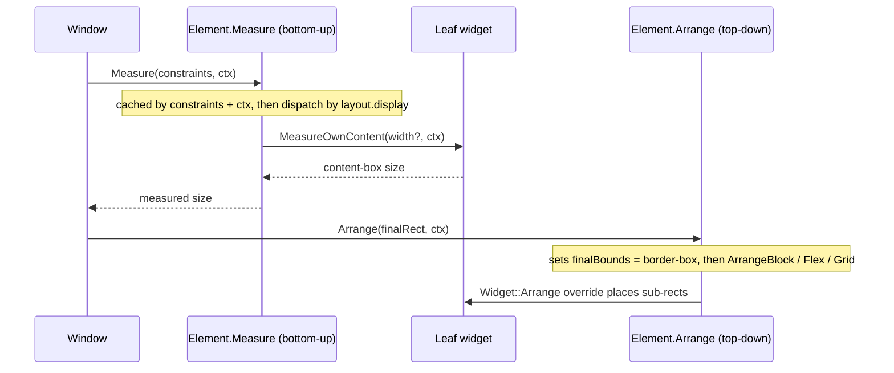

# CSS Layout in UltraCanvas

A short guide to the CSS-style layout engine (`UltraCanvas::CSSLayout`) and the contract
every UI element must follow to integrate with it.

## Overview

UltraCanvas lays out its UI with a small CSS-style layout engine living in
[CSSLayout.h](../UltraCanvas/include/CSSLayout/CSSLayout.h) and `UltraCanvas/core/CSSLayout/*.cpp`.
Every widget derives from `UltraCanvasUIElement`, which in turn derives from
`CSSLayout::Element` — so each UI element *is* a layout node. Layout runs as a **two-phase
Measure → Arrange pass**, driven once per frame from the window render loop. Widgets
describe *what they need* (intrinsic content size); the engine decides *where everything
goes* and writes the result into each element's `finalBounds`.

> **Golden rule:** UI elements must conform to the CSS layout engine — implement
> `MeasureOwnContent()` / `Arrange()` where needed and **never modify `finalBounds`
> manually**. The engine owns placement.

## Scope & limitations

The engine implements a useful subset of CSS, not the whole specification.

**Supported layout modes:**

- **Flex** (`display: flex`) — direction, wrap, grow/shrink/basis, justify/align, gap, order
- **Grid** (`display: grid`) — explicit placement, auto-placement, track sizing (px / % / fr / auto / min/max-content / fit-content), gaps. Columns are sized first, then rows with each item measured at the width of the columns it spans, so wrapped text makes its row taller (CSS Grid §12.1). An auto-placed item spanning more columns than the grid has adds implicit columns.
- **Block** (`display: block`, the default) — children stacked vertically; each in-flow
  child's margin offsets it and adds to the stack, and its left/right margin narrows the
  width it is offered (percentages resolve against the content width)
- **Table** (`DisplayType::Table`) — HTML's automatic table layout; see
  [Table layout](#table-layout) below
- **Absolute positioning** — `Absolute`, `Fixed`, `Relative`, and the UI-specific `AbsoluteUI`

**Not implemented yet** (do not rely on these):

- **No normal flow / inline layout.** `Inline` and `InlineBlock` fall through to Block
  (see the `TODO` at `Element.cpp:214-215`) — there is no inline formatting context, no
  text-run wrapping across boxes, no baseline alignment.
- **No `table-row` / `table-cell` display types.** A table's cells are its direct
  children, placed by row and column (see [Table layout](#table-layout)); there are no
  row boxes and no anonymous-box generation.
- Minor gaps: LTR writing-mode only; no margin collapsing (in Block as in Flex, two
  stacked siblings are separated by the *sum* of their facing margins); Block does not
  centre on `margin: auto` (an auto margin is 0 there); Grid named lines / template
  areas / subgrid / masonry / dense packing are not implemented (the HTML reader resolves
  `grid-template-areas` to line numbers itself), and grid items' margins are not applied.

## How it integrates with the UI framework


```mermaid
flowchart TD
    A["UltraCanvasUIElement<br/>(: public CSSLayout::Element)"] --> B["Window render loop<br/>(dirty + visible window)"]
    B --> C["Measure(constraints, ctx)"]
    C -->|"leaf reports size via"| D["MeasureOwnContent()"]
    C --> E["Arrange(finalRect, ctx)"]
    E -->|"dispatch by layout.display"| F["ArrangeBlock / Flex / Grid"]
    F --> G["sets finalBounds<br/>(border-box)"]
    G -->|"internal placement"| H["Widget::Arrange() override"]
    G --> I["Render() uses finalBounds"]
```

The window calls `Measure()` then `Arrange()` on the root each frame for visible, dirty
windows (see [UltraCanvasWindow.cpp:343-350](../UltraCanvas/core/UltraCanvasWindow.cpp#L343-L350)):

```cpp
CSSLayout::MeasureConstraints mc{
    { CSSLayout::ConstraintMode::Exact, lctx.viewportWidth  },
    { CSSLayout::ConstraintMode::Exact, lctx.viewportHeight }
};
this->Measure(mc, lctx);
this->Arrange(finalBounds, lctx);
```

## The element contract — every UI element must conform

A widget participates in layout by overriding two virtual hooks declared on
`CSSLayout::Element` ([CSSLayout.h:433-436](../UltraCanvas/include/CSSLayout/CSSLayout.h#L433-L436)):

```cpp
virtual Size2Df MeasureOwnContent(std::optional<float> definiteContentWidth,
                                  const LayoutContext& ctx);
virtual void    Arrange(const Rect2Df& finalRect, const LayoutContext& ctx);
```

**1. `MeasureOwnContent()` — report intrinsic content size.**
A *leaf* widget (label, image, icon, button text) overrides this to return its own
**content-box** size, *excluding* padding and border. Pure containers don't need it — the
base returns `{0, 0}` and the engine sizes them from their children. When the engine needs
to wrap content it passes a `definiteContentWidth`; otherwise it asks for max-content
(`std::nullopt`). Example from `UltraCanvasLabel` (`UltraCanvasLabel.cpp:193-212`):

```cpp
Size2Df UltraCanvasLabel::MeasureOwnContent(std::optional<float> definiteContentWidth,
                                            const CSSLayout::LayoutContext&) {
    if (!EnsureTextLayout()) return Size2Df(0.f, 0.f);
    if (definiteContentWidth.has_value()) {           // height at a resolved width (wrapping)
        float w = std::max(0.f, *definiteContentWidth);
        textLayout->SetExplicitWidth(w);
        return Size2Df(w, (float)textLayout->GetLayoutHeight());
    }
    textLayout->SetExplicitWidth(-1);                 // max-content: natural width
    return Size2Df((float)textLayout->GetLayoutWidth(),
                   (float)textLayout->GetLayoutHeight());
}
```

**2. `Arrange()` — place internal sub-rects only.**
Override `Arrange()` *only* to lay out a widget's internal parts (e.g. a button's text and
icon) in local coordinates, **after** delegating to the base, which sets `finalBounds`.
Example from `UltraCanvasButton` (`UltraCanvasButton.cpp:842-848`):

```cpp
void UltraCanvasButton::Arrange(const Rect2Df& finalRect, const CSSLayout::LayoutContext& ctx) {
    // The engine sizes/places us (finalBounds) from the measure pass; we just
    // lay out the internal sub-rects (text/icon/split sections) in local coords.
    UltraCanvasUIElement::Arrange(finalRect, ctx);
    CalculateLayout();
}
```

**3. Do NOT modify `finalBounds` manually.**
`finalBounds` is engine-owned and written by `Arrange()`. Avoid the legacy
`SetPosition()` / `SetSize()` setters (they bypass the engine and can break layout — note
the warning at [UltraCanvasUIElement.h:218](../UltraCanvas/include/UltraCanvasUIElement.h#L218)).
Prefer `SetElementSize()` / `SetElementAbsolutePosition()`, which update the CSS properties
and let the engine recompute placement.

## The two-phase layout


```mermaid
sequenceDiagram
    participant W as Window
    participant E as Element.Measure (bottom-up)
    participant L as Leaf widget
    participant A as Element.Arrange (top-down)
    W->>E: Measure(constraints, ctx)
    Note over E: cached by constraints + ctx, then dispatch by layout.display
    E->>L: MeasureOwnContent(width?, ctx)
    L-->>E: content-box size
    E-->>W: measured size
    W->>A: Arrange(finalRect, ctx)
    Note over A: sets finalBounds = border-box, then ArrangeBlock / Flex / Grid
    A->>L: Widget::Arrange override places sub-rects
```

- **Measure** (`Element::Measure`, `Element.cpp:187`) computes each node's content-box size
  given its constraints, bottom-up. Results are cached by constraints *and* layout context
  (viewport, font size, DPI), so unchanged subtrees are skipped. Besides the current result
  (`measured`), each element keeps its last eight results under other constraints
  (`measureCache`). A flex or grid parent measures a child several ways (at its max-content,
  at its line's size, stretched), and does it again each time it is measured itself. With
  one cached result, nested flex boxes re-measured their whole subtree at every level and
  layout time doubled per level of nesting. `InvalidateLayout` / `InvalidateSubtree` clear
  both; code that drops a cached size by hand calls `ForgetMeasurements()`, not
  `measured.valid = false`.
- **Arrange** (`Element::Arrange`, `Element.cpp:241`) walks top-down, writes each node's
  border-box into `finalBounds`, and dispatches to `ArrangeBlock` / `ArrangeFlex` /
  `ArrangeGrid` to place children.

### Do not change the tree from inside `Arrange`

An `Arrange` override is the right place to *read* the size the engine settled
on — it is the only place that knows it, and a window-resize callback is a pass
behind. It is the wrong place to act on it by adding, removing, showing or
hiding a child: the pass is midway through placing that flex line, and the
child it is holding comes out of it with a stale size. Hiding one sibling this
way leaves the other zero-wide, and it stays zero-wide through every later pass,
because nothing marks it dirty again.

Report from `Arrange` and act on the next turn of the event loop — a one-shot
`UltraCanvasApplication::StartTimer(1, false, …)` is the framework's usual way
of saying that. `UltraFilerSearchBox` in `Apps/UltraFiler/UltraFilerWindow.cpp`
does exactly this to drop its in-field button when the command bar narrows.

## `finalBounds` is a border-box

`finalBounds` now holds the element's **border-box** (border + padding + content;
**margin excluded**), positioned relative to the parent's border-box origin. UI elements
default to `box.boxSizing = BorderBox`
([UltraCanvasUIElement.h:141](../UltraCanvas/include/UltraCanvasUIElement.h#L141)), so an
explicit `width`/`height` describes the border-box directly.

```
   margin (NOT part of finalBounds)
 +···································+
 :  +-----------------------------+  :   <-- finalBounds = border-box
 :  |          border             |  :       (.x/.y relative to parent's
 :  |  +-----------------------+  |  :        border-box origin)
 :  |  |       padding         |  |  :
 :  |  |  +-----------------+  |  |  :
 :  |  |  |    content      |  |  |  :   <-- MeasureOwnContent() reports
 :  |  |  |   (own content) |  |  |  :       THIS box (content-box)
 :  |  |  +-----------------+  |  |  :
 :  |  +-----------------------+  |  :
 :  +-----------------------------+  :
 +···································+

 finalBounds.width  = content + padding(L+R) + border(L+R)
 finalBounds.height = content + padding(T+B) + border(T+B)
```

## Constructors & position type

UI elements expose three constructor forms. The form you pick determines the element's
CSS position type and how the engine sizes it:

| Constructor | Example | Resulting CSS layout |
| --- | --- | --- |
| `(id, x, y, w, h)` — full rect | `UltraCanvasButton("b", 10, 10, 80, 30)` | non-zero `x`/`y` ⇒ **`PositionType::AbsoluteUI`** — fixed size, placed at (x, y) |
| `(id, w, h)` — size only | `UltraCanvasButton("b", 80, 30)` | static **Block**, fixed size; engine *places* it |
| `(id)` / no size — fit-content | `UltraCanvasButton("Save")` | static **Block**, auto **fit-content** size |

**`AbsoluteUI` is a UI-specific extension, not standard CSS.** It positions exactly like
`Absolute` (against the containing block's padding-box) **but also contributes to the
container's measured size** during Measure — the container grows to cover `left+width` /
`top+height`. Plain `Absolute` keeps the standard CSS behaviour of *not* affecting the
parent's size. From [CSSLayout.h:127-131](../UltraCanvas/include/CSSLayout/CSSLayout.h#L127-L131):

```cpp
// AbsoluteUI: positioned exactly like Absolute (against the padding-box),
// but ALSO contributes to the container's measured size during Measure
// (the container grows to cover left+width / top+height). Opt-in; plain
// Absolute keeps the standard CSS behavior of not affecting parent size.
enum class PositionType   { Static, Relative, Absolute, Fixed, AbsoluteUI };
```

The full-rect constructor stamps `AbsoluteUI` **only for a real non-zero offset**
([UltraCanvasUIElement.h:144-155](../UltraCanvas/include/UltraCanvasUIElement.h#L144-L155)) —
flex/grid children are conventionally built with `(0, 0, w, h)` so they stay in flow and
the parent's algorithm can place them. Note also that an explicit `width`/`height`
**overrides** the parent's stretch (`align-items` / `justify-items: stretch`), though not
the element's own `align-self: stretch`; for a widget you want the engine to size or
stretch, use the no-size constructor (or pass `0, 0`). See
[Stretching is a design decision](#stretching-is-a-design-decision).

## Quick guidelines

- **Prefer Flex / Grid layouts over absolute positions.**
- For children of a flex/grid container, use the **no-size** (or `(0,0)`) constructor so the
  parent's algorithm sizes them; pass a fixed `w`/`h` only when you truly want a fixed box.
- **Ask for stretch where the design wants it.** Nothing stretches by default; a container
  that should fill its children across says `SetFlexAlignItems(AlignItems::Stretch)` (grid:
  `SetGridJustifyItems` / `SetGridAlignItems`), one child says `SetAlignSelf(Stretch)`.
- For **leaf widgets**, implement `MeasureOwnContent()` to publish the content-box size.
- Override `Arrange()` only for internal sub-rect placement — call the base first.
- **Never write to `finalBounds` directly;** use `SetElementSize()` /
  `SetElementAbsolutePosition()` if you must set geometry imperatively.
- Toggle visibility with `SetVisible()` — it flows through `layout.display` (`NoDisplay`)
  and invalidates layout for you.
- When a setter changes something that affects the element's **size** (text, count,
  font, style), call `InvalidateLayout()` in addition to `RequestRedraw()` — a redraw
  alone repaints the *old* bounds; only an invalidation makes the engine re-measure.

## Recipe: a box that grows with its content but keeps a minimum size

A card/tile whose content can get wider (a row of counters whose numbers grow, a
label with a longer name) must **not** be given an explicit width: an explicit
`size.width` overrides fit-content, and containers clip their children to the
content area, so the overflowing row is silently cut off instead of widening the
frame. Leave the axis that must grow **auto**, and express the design's baseline
as a *minimum*:

```cpp
// Auto width (grows with the content), fixed height, never narrower than 176.
auto tile = std::make_shared<UltraCanvasContainer>("tile", 0, 0, 0, 0);  // 0 ⇒ Auto
tile->size.height = CSSLayout::Dimension::Px(176);
CSSLayout::BoxConstraints limits;
limits.minWidth = CSSLayout::Dimension::Px(176);
tile->boxConstraints = limits;

tile->layout.SetFlexColumn()
            .SetFlexGap(10)
            .SetFlexJustifyContent(CSSLayout::JustifyContent::Center)
            .SetFlexAlignItems(CSSLayout::AlignItems::Center);   // keeps rows centred
```

Every auto-sized row inside then shrink-wraps its children and is centred by
`AlignItems::Center`, so the whole stack stays on the tile's centre line as it
widens. Children whose content changes must call `InvalidateLayout()` from their
setters (the framework's own widgets do) — otherwise the engine keeps the cached
measurement.

> **Caveat:** a flex container honours an *item's* `boxConstraints` on the **main
> axis only** ([FlexLayout.cpp:470](../UltraCanvas/core/CSSLayout/FlexLayout.cpp#L470)).
> For a child of a flex **row**, `minWidth` works but `minHeight` is ignored —
> give that axis an explicit `size.height` (as above) when it does not need to grow.
>
> A flex container's **own** `boxConstraints` are honoured on both axes, against
> its border box, like any other box (CSS Sizing §4). That is the way to say
> "this bar is at least this thick, and thicker when its contents need it":
> leave `size` auto on that axis and set the minimum.
> `UltraCanvasToolbar` does exactly this with the thickness its host constructs
> it with — see `Tests/ToolbarThicknessTest.cpp`.

Sizes and limits may be percentages of the container. A width percentage
resolves against the width the parent offers. A height percentage - `size.height`,
`minHeight`, `maxHeight` - needs a definite height: one passed down as a
constraint (flex, grid, table), or - for a child of a block layout, which stacks
its children with unbounded height - the block parent's own set height, which it
records on each child as `percentHeightBase` (so `Pct(50)` inside a box of
`Px(200)` is 100, and 50% of that inside it 50). With neither, as in CSS, a
percentage height is auto and a percentage limit limits nothing.

A `Dimension` can carry pixels on top of its value, CSS's `calc(50% - 20px)`:
`Dimension::PctPlus(50, -20)`, or any `Dimension` with `offsetPx` set. The
offset is added when the value resolves (px, %, vw / vh, em / rem); a percentage
that cannot resolve stays unresolved. The HTML reader uses it for a percentage
`max-width` under `box-sizing: border-box`, where the limit loses the box's
padding and border, and for a content-box percentage width or height, where the
border-box size gains them (`width: 50%; padding: 0 10px` is
`PctPlus(50, 20)`).

`Apps/UltraMail/ui/UltraMailAccountBar.cpp` is a worked example: an account tile
with a provider letter, an address and a row of `UltraCanvasBadge` counters that
widens as the counts grow.

## Recipe: a form whose captions line up and still translate

A dialog's "caption: control" rows belong in **one** grid of `[auto, 1fr]`, not
in a flex row each: the `auto` column is then exactly as wide as the widest
caption in the form — in any language — and every control starts where it ends.
`UltraCanvasFormLayout.h` is that grid plus four helpers; see
[UltraCanvasFormLayout](UltraCanvas/UltraCanvasFormLayout.md).

An item that spans every column of such a grid (a checkbox, a heading, a note)
does **not** drag the `auto` column out to its own width: per CSS Grid §12.5 an
item whose span crosses a flexible track contributes nothing to the base size of
the intrinsic tracks it also spans, and the flexible track absorbs it. A grid
with no `fr` track still distributes a spanning item over its intrinsic tracks.
`Tests/CSSLayoutFormGridTest.cpp` pins both.

## Flex base sizes and wrapping content

`ComputeIntrinsicSizes()` publishes **max-content** sizes — what the content takes with
unbounded space, i.e. one line for text. A flex **row** takes an item's published
max-content *width* as its flex base size directly, which is exactly right. A flex
**column** must not do the same with the published *height*: the main size of a column
item depends on the cross size it is given, so the engine measures such an item instead
(`FlexLayout.cpp`, `computeBaseSize`), and the block path inside that measure resolves
the content width first and then asks the widget for its height at that width
(`MeasureOwnContent(contentWidth)`). That is what makes a wrapped label in a flex column
as tall as its lines rather than one line tall.

So: a widget whose height depends on its width reports that dependency through
`MeasureOwnContent()` — the definite-width branch — and nothing else is required of it.

## Alignment is safe: overflowing content is never pushed off the leading edge

`align-items` / `align-self` (and `justify-content`, which distributes only
non-negative free space) **align to the start when the content does not fit**. This is
CSS Box Alignment's `safe` fallback, and in this framework it is the only correct
behaviour rather than an option: a container clips its children to its content box and
its scrollbar starts at that edge, so anything placed at a negative offset — above the
content origin, or left of it — cannot be scrolled to and is simply lost.

```cpp
// A pane that centres what fits and scrolls to what does not.
pane->layout.SetFlexRow()
            .SetFlexJustifyContent(CSSLayout::JustifyContent::Center)
            .SetFlexAlignItems(CSSLayout::AlignItems::Center);
pane->AddChild(view);   // taller than the pane ⇒ starts at its top, overflows below
```

An item shorter than the line is still centred. An item taller than it starts at the
line's top and overflows at the bottom, where the container's scrollbar reaches it —
which is what the demo's LaTeX page needs: its tall formulas used to be centred into a
negative offset and lost their top half, with the vertical scrollbar already at the top
and no way to bring it back. `Tests/CSSLayoutSafeAlignTest.cpp` pins this, including the
scroll-range arithmetic `UltraCanvasContainer::UpdateScrollability` performs.

The grid engine needs no such fallback: `ArrangeGrid` sizes a non-stretch item to
`min(track, natural)`, so a grid item can never be larger than the area it is aligned in.

## Stretching is a design decision

The engine stretches nothing on its own. A child is stretched across its container only
when the layout asks for it, and the most specific statement wins: the child's own
`align-self` / `justify-self`, then the child's own size, then its container's
`align-items` / `justify-items`.

| Who asks | Flex | Grid |
|---|---|---|
| the container, for every child | `layout.SetFlexAlignItems(AlignItems::Stretch)` | `layout.SetGridJustifyItems(JustifyItems::Stretch)` (across the column), `layout.SetGridAlignItems(AlignItems::Stretch)` (down the row) |
| one child (wins over its own size) | `layoutItem.SetAlignSelf(AlignSelf::Stretch)` | `layoutItem.SetJustifySelf(...)`, `layoutItem.SetGridAlignSelf(...)` |
| the default | `AlignItems::Start`: each child at its own size, at the start | `Start` both ways; a grid item's `Auto` takes the container's |

- **A set size beats the container's stretch.** A child with a `width` (in a column, or a
  grid cell's width) or a `height` (in a row, or a grid cell's height) keeps it when only
  its container asks for `Stretch`, aligned to the start — CSS Flexbox §9.4 step 11, CSS
  Box Alignment §6.1. A 200 px button in a stretching column is 200 px; a text input that
  should fill the column is one built without a width.
- **The child's own stretch beats its size.** `layoutItem.SetAlignSelf(Stretch)` (grid:
  `SetJustifySelf` / `SetGridAlignSelf`) stretches the child over a width or height it
  carries. CSS would keep the size; here a size often comes from a constructor that needs
  one, while an `align-self` is always meant, so this is the one place the engine departs
  from CSS. A reader mapping a stylesheet drops an `align-self: stretch` that CSS would
  ignore.
- **A negative size is no size.** CSS rejects a negative `width` / `height`; here `-1` is
  the "not set" marker and a size computed before the window had one can come out
  negative, so a negative length counts as automatic.
- **Finding leftovers:** run an application with `ULTRACANVAS_LAYOUT_AUDIT=1` and every
  child whose set size outranked its container's stretch is printed once on stderr, with
  both sizes — a size given only because a constructor wanted one shows up there.
- **Wrapping still works.** A child that is not stretched is measured against the
  container's width as an upper bound, so a word-wrapping label in a `Start` column still
  wraps at the column's width; it is just not widened past its text.
- **For a stylesheet reader:** the CSS initial value of `align-items` is `stretch`, so code
  that maps CSS onto these structures sets `Stretch` explicitly wherever the sheet leaves
  `align-items` unset.
- Until 2026-10-06 flex `align-items` and grid items defaulted to stretch and a set size
  was stretched over; the containers in the framework and apps that relied on that ask for
  it explicitly now. `Apps/CSSLayoutTests` (Phase 11) pins the rule.

## Table layout

`DisplayType::Table` is the automatic table layout browsers use for HTML tables
(CSS 2.1 §17.5.2.2), in `core/CSSLayout/TableLayout.cpp`. The HTML reader builds every
`<table>` on it; use it anywhere columns must line up across rows whose content decides
their width. The cells are the container's direct children, each placed with
`SetGridRowColSimplified(row, column, rowSpan, colSpan)`:

```cpp
table->layout.SetTableSpacing(2, 2);                 // border-spacing; also sets display: table
cell->layoutItem.SetGridRowColSimplified(0, 1, 1, 3);   // row 0, column 1, spanning 3 columns
cell->size.width = CSSLayout::Dimension::Px(128);    // a fixed column (Pct(40) = a % column)
table->AddChild(cell);
```

- Every cell reports a **min-content** width (its widest unbreakable run —
  `UltraCanvasLabel` publishes it; a `WrapNone` label's is its whole line — or its px
  width) and a **max-content** width (one line). A column's min / max is the largest of
  its one-column cells; a spanning cell widens its columns only by what they lack.
- A cell's `size.width` in px makes its column **fixed**, in % a **percentage** column;
  the rest are **auto**. A table with its own width uses it (never less than the
  columns' minimum); an auto-width table shrinks to its preferred width.
- The width is handed out minimum first, then fixed, then %, then auto columns up to
  max-content, each group proportionally when short; what is left widens the auto
  columns (else the % ones).
- A row is as tall as its tallest cell at its column width; every cell is **stretched**
  to its row(s), so its background fills the slot. Aligning a cell's content vertically
  is the cell's job — the HTML reader makes cells flex columns with `justify-content`.
- The spacing applies between the cells and around the outer ones, as `border-spacing`
  does. `Tests/HTMLTableLayoutTest.cpp` pins the column sharing, spans and widths.

Why not Grid: `ArrangeGrid` sizes rows from each item's max-content height at unbounded
width (a wrapped paragraph gets one line) and has no min-content column distribution, so
a table built on it cannot keep a label column narrow while a long value wraps.

## Troubleshooting: my widget renders nothing at all

The most common contract violation fails **silently**: an auto-sized leaf widget
(no explicit `w`/`h`, factory passes `0, 0`) that does **not** implement
`MeasureOwnContent()` / `ComputeIntrinsicSizes()` measures as `{0, 0}`, so `Arrange()`
resolves it to a **0×0 border-box** — and containers cull zero-sized children before
`Render()` is ever called. No warning is logged; the widget simply never appears.

Checklist when a widget is invisible:

1. **Does it publish an intrinsic size?** Leaf widgets must override
   `MeasureOwnContent()` (and `ComputeIntrinsicSizes()` for flex/grid parents). Setting
   `finalBounds` from the constructor or from `Render()` does **not** work — the next
   Arrange pass overwrites it (see the golden rule above). `UltraCanvasLabel` and
   `UltraCanvasBadge` are exemplars.
2. **Is it unintentionally in flow?** An element meant to *overlay* a sibling (badge on
   an icon, resize handle, tooltip anchor) that is constructed at `(0, 0)` stays a
   static in-flow child and gets stacked by the parent's layout. Take it out of flow
   with `PositionType::AbsoluteUI` (see `UltraCanvasBadge::AnchorTo` for the pattern).
3. **No render context during Measure?** `MeasureOwnContent()` may run before the
   element can reach a window's render context (text can't be measured yet). Return a
   sensible style-based fallback instead of `{0, 0}` where one exists, and let the next
   measured pass refine it.
