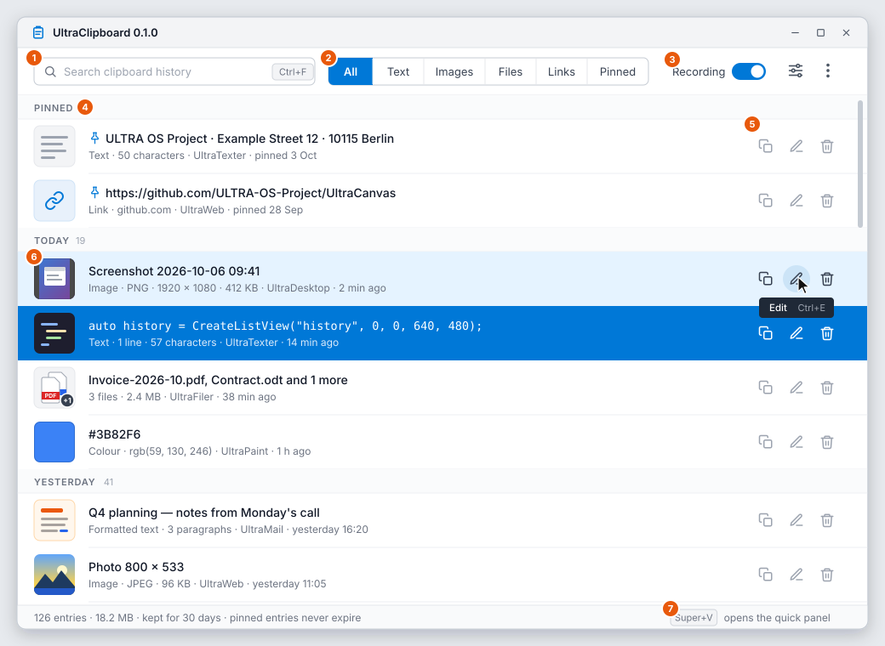
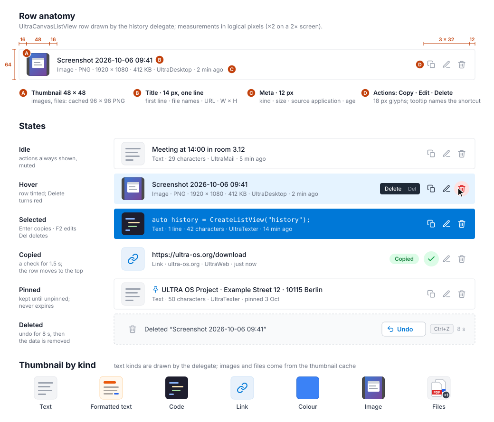
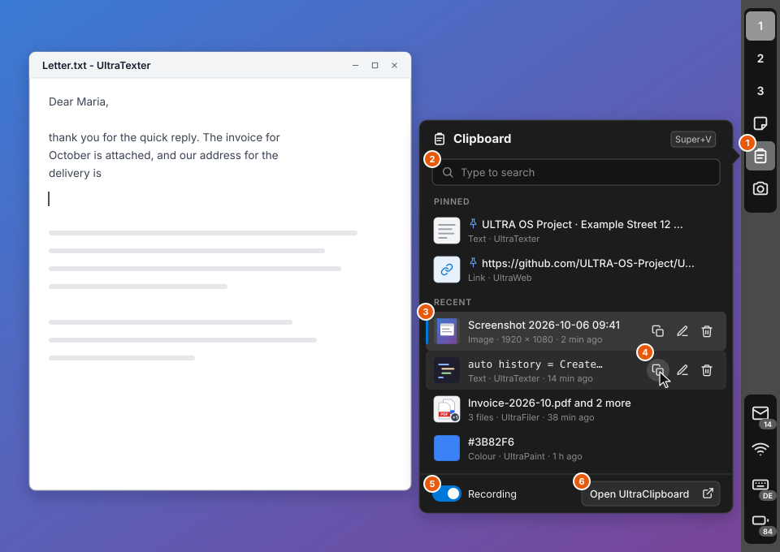
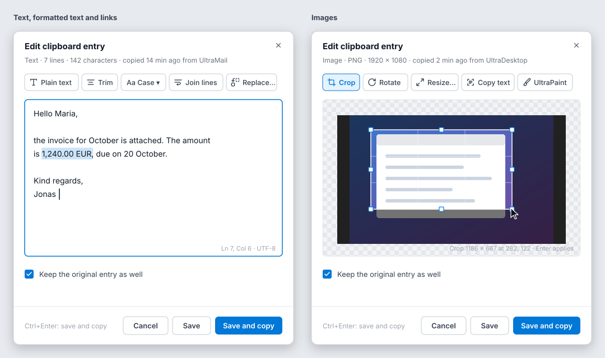

# UltraClipboard — a clipboard manager for the ULTRA OS desktop (Investigation and Proposal)

**Date:** 2026-10-06
**Status:** Phases 1 and 2 implemented, with part of phases 0 and 3 — §13 lists what was built and where it departs from this proposal; the rest is still a proposal
**Scope:** a clipboard history that records everything copied on ULTRA OS,
shown in two places. The first is a **quick panel** that the desktop's
clipboard button and `Super+V` open. The second is a separate application,
`Apps/UltraClipboard`, for the whole history: search, pin, copy, edit and
delete, with a thumbnail for every entry. The framework changes both of them
need are part of the scope too.

This document follows the other investigations in this directory.
[`UltraCalendarDesignProposal.md`](UltraCalendarDesignProposal.md) is the
closest in shape, because it asks the same question: *which parts belong in
the framework, which in the desktop and which in the app*. Everything said
below about the repository was checked against the tree on this date, and
file references are to the current `main`. What is said about other operating
systems and clipboard managers comes from their published documentation as
the author knows it. Where a detail could not be checked from this
environment it is marked **[unverified]** rather than guessed.

The UI mock-ups are SVG files in [`UltraClipboard/`](UltraClipboard/):

| Mock-up | Shows |
|---|---|
| [`UltraClipboard-Overview.svg`](UltraClipboard/UltraClipboard-Overview.svg) | The application's main window: the history as a list (§6.1) |
| [`UltraClipboard-RowAnatomy.svg`](UltraClipboard/UltraClipboard-RowAnatomy.svg) | One row: its measurements, its states, the thumbnail per kind (§6.2) |
| [`UltraClipboard-QuickPanel.svg`](UltraClipboard/UltraClipboard-QuickPanel.svg) | The quick panel on the desktop's right bar (§6.3) |
| [`UltraClipboard-Edit.svg`](UltraClipboard/UltraClipboard-Edit.svg) | The edit dialog for a text entry and for an image entry (§6.4) |

---

## 1. Recommendation

**The desktop records and the application shows.** UltraDesktop already
watches the clipboard for its 15-item menu, so it becomes the one recorder. It
writes every copy, in every format the source offered, into a persistent,
encrypted history. That history lives in a new headless framework class,
`UltraCanvasClipboardHistory`. The desktop replaces its menu with a quick
panel (search, thumbnails, copy, edit and delete). A new application,
`UltraClipboard`, opens the same history in a full window for searching,
pinning, editing and settings. Before any of this, fix the framework
clipboard: today it only notices **text** changes, so a copied image or file
never reaches the history (§3.3). The two worst defects, a copied password
kept in the desktop's menu and the menu showing the oldest entries, are
fixed in the same change as this proposal.

Why each choice was made, in one line each; the rest of the document is the
evidence:

| Decision | Reason |
|---|---|
| A quick panel in the desktop **and** a separate app (§5.1) | The request is for an app integrated into the desktop. The quick panel is that integration: it replaces the menu that the right bar's clipboard button opens today (`Apps/UltraDesktop/ui/UltraDesktopWindow.cpp:876`). A list you search, filter, edit and configure needs a window of its own. Windows (`Win+V` and Settings), KDE (Klipper's popup and its configuration window) and CopyQ all split it the same way. |
| The desktop records, not the app (§5.2) | A history only exists if something records while the app is closed. UltraDesktop runs for the whole session and already starts the monitor (`UltraDesktopWindow.cpp:127-129`). Where no ULTRA OS desktop runs (Windows, macOS, another Linux desktop), the app records itself. A lock file decides who records, so two recorders never write the same copy twice. |
| A headless `UltraCanvasClipboardHistory` in the framework (§5.1, §8.2) | Two processes, the desktop and the app, read and write one history. The tree's rule is the engine in the framework and a thin app (UltraMail's engine library; the UltraCalendar proposal). The store builds and tests without a display. |
| Clipboard events, not text polling (§5.3) | Today the monitor reads the whole clipboard text every 500 ms (`UltraCanvas/core/UltraCanvasClipboard.cpp:273`), and only a *changed text* counts as a change (`:284`; the Linux backend compares text too, `UltraCanvas/OS/Linux/UltraCanvasLinuxClipboard.cpp:259`). Copying an image or files therefore records nothing. XFixes on X11, `AddClipboardFormatListener` on Windows and `NSPasteboard.changeCount` on macOS report *every* change, for every format, without polling. |
| Keep every standard format of a copy (§5.4) | A copy from a browser or word processor offers HTML and plain text, UltraPaint offers an image, and UltraFiler offers a file list and a cut flag. Putting back only the text loses what was copied: today a formatted-text entry is put back as plain text (`UltraCanvasClipboard.cpp:380-381`), and of several copied files only the first is kept (`:321`). |
| SQLite index, content-addressed blobs, encrypted at rest (§5.5) | UltraDatabase holds the index, and each payload is one file named by its SHA-256, so an image copied twice is stored once. Payloads are encrypted with XChaCha20-Poly1305 (UltraCrypt) under a key kept in a `DeviceKeyVault`. This protects a backup or a stolen disk. It does **not** protect against a program running as the same user, and the settings page says so. |
| Never record what the source marks as secret (§5.6) | Password managers mark their copies: `x-kde-passwordManagerHint` on X11, `ExcludeClipboardContentFromMonitorProcessing` on Windows, `org.nspasteboard.ConcealedType` on macOS. The recorder honours all three. Until this change UltraPassword marked nothing, so a copied password sat in the desktop's menu (§3.3 item 1, now fixed). |
| The desktop keeps the clipboard alive after the source quits (§5.7) | On X11, the clipboard is held by the program that copied, so closing it empties the clipboard. A desktop that records every copy can answer the freedesktop `CLIPBOARD_MANAGER` protocol and keep the last copy pasteable. |
| Rows are an `UltraCanvasListView` with a delegate, and the actions are one real toolbar (§6.6) | The house rule says anything that takes input is an element. A history of 500 entries needs a virtualised list. One `UltraCanvasToolbar` (Copy, Edit, Delete) is placed over the row under the pointer or the selected row, which gives tooltips, focus and keyboard for free. It is proposed as a general ListView feature, *row actions* (§8.4), because UltraFiler and UltraMail want the same thing. |

**Do not** let the app record on its own while the desktop also records: two
writers mean every copy is stored twice. **Do not** keep a plain-text search
index on disk next to an encrypted store: search runs in memory over the
decrypted history (§5.10). **Do not** sync the history between devices in the
first version (§12).

---

## 2. What was asked, restated

1. A **clipboard app**, **integrated into the ULTRA OS desktop**.
2. An **overview list** of clipboard entries, each with a **thumbnail** and
   **copy**, **delete** and **edit** actions.
3. A **design proposal**, with **SVG visual proposals** of the UI.

The request leaves out three requirements that every user will expect:

- The history **survives** the app being closed, the desktop restarting and a
  log-out. An in-memory list, which is what the desktop has today, does not.
- **Passwords** copied from a password manager are **not** kept.
- Everything works from the **keyboard**: open, search, choose and paste
  without the mouse.

---

## 3. What the tree has today

### 3.1 The framework clipboard — `UltraCanvasClipboard`

`UltraCanvas/include/UltraCanvasClipboard.h` is a platform-independent facade
over one backend per platform (`UltraCanvas/OS/<Platform>/UltraCanvas*Clipboard.*`
for Linux, Windows, macOS, Android and WebAssembly):

| Capability | State |
|---|---|
| Text, image bytes, file lists | Read and write on every desktop backend |
| HTML with its plain text (`SetHtml`), file lists with a cut flag (`SetFiles(paths, cut)`) | Linux and Windows; macOS falls back to plain text and plain file lists (the base-class defaults) |
| A history: `AddEntry`, `RemoveEntry`, `ClearHistory`, `GetEntries`, `CopyEntryToClipboard` | In memory, per process, at most `MAX_ENTRIES = 100` (`UltraCanvasClipboard.h:143`) |
| Monitoring: `StartMonitoring`, `Update()` | `UltraCanvasApplication` calls `Update()` every loop (`UltraCanvasApplication.cpp:659-660`); a check runs every 500 ms |
| An entry: `ClipboardData` | Type (Text, Image, RichText, FilePath, Vector, Animation, Video, ThreeD, Document), content, raw bytes, MIME type, timestamp, a 50-character preview, a `thumbnail` path field |

### 3.2 The desktop's clipboard button

UltraDesktop's right bar carries a clipboard button
(`Docs/UltraDesktop/README.md`, *Right bar*). It opens a popup
`UltraCanvasMenu` headed *Clipboard history*, which lists up to fifteen
entries; choosing one puts it back on the clipboard, and *Clear history* empties
the list (`UltraDesktopWindow.cpp:876-914`). The desktop calls
`StartMonitoring()` at start-up (`:127-129`), so its process is the one that
records. Nothing is written to disk.

### 3.3 Defects found while reading

These are in the existing code and should be fixed whether or not the app is
built. Phase 0 of the roadmap (§10) is exactly this list. Items 1 and 2 are
**fixed in the same change as this proposal**. The descriptions below are of
the code before that change, and line numbers refer to it.

1. **A copied password is kept and shown.** *(Fixed: `ClipboardHint::Secret`, §8.1.)* UltraPassword copies a password
   with plain `SetClipboardText` (`Apps/UltraPassword/ui/PasswordApp.cpp:891-901`)
   and clears the clipboard 30 seconds later. By then the desktop's monitor
   has recorded it. It stays in the desktop's history, and its first 50
   characters appear in the clipboard menu, until a hundred newer copies
   push it out or the user clears the history. The 30-second clear protects
   the clipboard, not the history.
2. **The desktop menu shows the oldest entries, not the newest.** *(Fixed.)* `AddEntry`
   inserts at the front (`UltraCanvasClipboard.cpp:227`), so the newest entry
   is index 0. The menu walks the list from the back, under the comment
   "Newest last in the store" (`UltraDesktopWindow.cpp:885-886`). Once there
   are more than fifteen entries, the menu shows the fifteen *oldest*, oldest
   first, and nothing copied since then can be chosen.
3. **Only text changes are recorded.** `ProcessNewClipboardContent` adds an
   entry only when `GetText` returns text that differs from the last text
   (`UltraCanvasClipboard.cpp:284`). On Linux, `HasClipboardChanged` likewise
   compares text (`UltraCanvasLinuxClipboard.cpp:259`). A screenshot copied to
   the clipboard, an image copied in a browser, or files copied in UltraFiler
   change no text and never enter the history. The menu's image branch
   (`UltraDesktopWindow.cpp:895`) is never reached.
4. **Every image is a "duplicate" of every other.** `RemoveDuplicateEntries`
   compares `content` and `type` (`UltraCanvasClipboard.cpp:461`). An image
   entry's `content` is empty, so a new image removes the previous image
   from the history. (Item 3 hides this today.)
5. **Several copied files become one.** Only `filePaths[0]` is kept
   (`UltraCanvasClipboard.cpp:321`).
6. **Formatted text comes back plain.** A RichText entry is put back with
   `SetText` (`UltraCanvasClipboard.cpp:380-381`), and the capture never reads
   HTML in the first place.
7. **`ClipboardData::thumbnail` is never filled.** The header calls it the
   "path to generated thumbnail for images" (`UltraCanvasClipboard.h:37`), but
   no code writes it.
8. **Polling reads the whole text twice a second.** The 500 ms check fetches
   the complete clipboard text from the owner, so a 10 MB text copied in an
   editor is transferred again and again while it stays on the clipboard.

---

## 4. Survey — what clipboard managers do

| Product | Where it lives | What it keeps | Worth taking |
|---|---|---|---|
| **Windows clipboard history** (`Win+V`) | A system flyout; settings in *Settings → System → Clipboard* | Text, HTML and bitmaps, about 25 entries, items up to about 4 MB **[unverified: exact limits]**; cleared at restart except pinned | Pinning; the flyout is opened by key and pastes into the window that had focus; the `ExcludeClipboardContentFromMonitorProcessing`, `CanIncludeInClipboardHistory` and `CanUploadToCloudClipboard` formats let a source opt out |
| **macOS** | No built-in history; third-party apps (Maccy, Paste, Raycast's history) | Varies | Search-first, keyboard-first panel (Maccy); the `org.nspasteboard.*` markers (`ConcealedType`, `TransientType`, `AutoGeneratedType`) that password managers set |
| **KDE Klipper** | A tray popup and a configuration window | Text and images; history size; can ignore the mouse selection | Honours `x-kde-passwordManagerHint=secret` (set by KeePassXC); *actions* run on matching text (open a URL, …) |
| **GNOME** | Extensions (Clipboard Indicator, Pano); GPaste as a daemon with its own UI | Text, images with Pano | A daemon that records plus a UI that only reads: the same split as §5.1 |
| **CopyQ** (cross-platform) | A tray icon, a main window with tabs | Every format, editable, scriptable | Editing entries in place; per-format storage; a size cap per item |

What this says for ULTRA OS:

- **Two surfaces.** Every product that people actually use has a small panel
  you open by key for "paste something I copied earlier", plus a full window
  for managing the history. One surface trying to do both is either too small
  to manage in or too heavy to pop up.
- **Search first.** In the panel, typing filters at once; the arrow keys and
  Enter do the rest.
- **Pinning** is the most-used management feature: addresses, IBANs, standard
  replies.
- **Opting out is the source's job,** through well-known markers. A recorder
  that ignores them stores every password a password manager copies.

---

## 5. Design decisions

### 5.1 Three parts: framework, desktop, application

```
UltraCanvas (framework, headless parts testable without a display)
  UltraCanvasClipboard          existing: get/set; gains change events, all formats,
                                the source's "secret" hint, the owning application
  UltraCanvasClipboardHistory   NEW: the store - record, list, search, pin, edit,
                                remove, restore to the clipboard, thumbnails, retention

UltraDesktop (runs for the whole session)
  recorder                      holds the recorder lock; clipboard events -> history
  clipboard manager             X11 CLIPBOARD_MANAGER: keeps the last copy pasteable (§5.7)
  quick panel                   replaces the 15-item menu; Super+V (§6.3)

Apps/UltraClipboard (opened when wanted)
  main window                   the whole history: search, filter, pin, copy, edit, delete (§6.1)
  edit dialog, settings         (§6.4, §6.5)
  recorder (fallback)           only when no desktop holds the lock (§5.2)
```

`UltraCanvasClipboardHistory` goes in `UltraCanvas/{include,core}`, not into
the app. The desktop and the app both link it, and it is the natural home for
the change notification between them (§5.5).

### 5.2 Who records

Exactly one process records, and it is whichever holds
`$XDG_RUNTIME_DIR/ultraos/clipboard-recorder.lock` (an `flock`ed file; on
Windows a named mutex). UltraDesktop takes the lock at start-up. UltraClipboard
tries it when it opens: if it gets the lock, no desktop is recording (Windows,
macOS, another Linux desktop), so the app records while its window is open
and says so in its status bar ("Recording while this window is open"). If the
desktop starts later, the app gives the lock up. The lock is released when its
process dies, so a crashed desktop never leaves the history unrecorded once
the app is opened.

### 5.3 Change detection: events, not polling

| Platform | Mechanism | Notes |
|---|---|---|
| X11 (ULTRA OS, Linux, BSD) | XFixes `XFixesSelectSelectionInput(CLIPBOARD, XFixesSetSelectionOwnerNotifyMask \| XFixesSelectionClientCloseNotifyMask)` | One event per new owner. A second copy in the same program sets the owner again and is reported too. `XFixesSelectionClientCloseNotify` is how §5.7 learns that the owner quit. XFixes ships with every X server and is one more library (`libXfixes`) |
| Windows | `AddClipboardFormatListener` → `WM_CLIPBOARDUPDATE` on a message-only window | Available since Vista; `GetClipboardSequenceNumber` de-duplicates |
| macOS | `NSPasteboard.generalPasteboard.changeCount`, polled every 250 ms | macOS has no notification. Reading the integer costs nothing, so this is polling only in name. The data is read only when the count moves |
| Wayland (later) | `ext-data-control-v1` (formerly `wlr-data-control`) | Only compositors that offer it; GNOME does not **[unverified: current state]**. Out of scope while the ULTRA OS desktop is X11 (`Docs/UltraCanvas/UltraCanvasDesktopShell.md`, *Backends*) |

The backend interface gains one callback, `SetChangeListener(callback)`. It is
called on the backend's own thread, does nothing but set a flag, and
`Update()` turns the flag into one capture. `HasClipboardChanged` stays for
callers that poll.

### 5.4 What an entry is

On a change, the recorder asks the source for its format list (`TARGETS` on
X11, `EnumClipboardFormats` on Windows, `types` on macOS) and reads:

| Read when offered | Stored as | Entry kind |
|---|---|---|
| `x-kde-passwordManagerHint` = `secret`, `ExcludeClipboardContentFromMonitorProcessing`, `CanIncludeInClipboardHistory` = 0, `org.nspasteboard.ConcealedType` or `TransientType` | **nothing**: the copy is not recorded (§5.6) | — |
| `text/uri-list` or `x-special/gnome-copied-files` with file URIs; `CF_HDROP` + `Preferred DropEffect`; `NSFilenamesPboardType` / `public.file-url` | the path list and the cut flag | Files |
| `image/png`, else another `image/*`, `CF_DIBV5` / `CF_DIB` (through `UltraCanvasClipboardDib`, open as [ULTRA-OS-Project/UltraCanvas#688](https://github.com/ULTRA-OS-Project/UltraCanvas/pull/688)), `public.png` / `public.tiff` | the original bytes, plus PNG when the original is not PNG | Image (`image/gif` with more than one frame: Animation; `image/svg+xml`: Vector) |
| `text/html`, `HTML Format`, `public.html`; `text/rtf` | HTML (or RTF) **and** its plain text | Formatted text |
| `UTF8_STRING` / `text/plain;charset=utf-8`, `CF_UNICODETEXT`, `public.utf8-plain-text` | UTF-8 text | Text — or Link when the trimmed text is one absolute URL, or Colour when it is one colour literal (`#3B82F6`, `rgb(…)`, `hsl(…)`) |

All the formats of one copy belong to one entry, and choosing *Copy* offers
them all again, so a formatted paste stays formatted. Application-private
formats (`application/x-qt-image`, an office suite's internal format) are kept
too if the whole entry stays under the per-item cap. Pasting back into the
same application then works as if the copy were fresh.

**Limits** (all in Settings, §6.5): 500 unpinned entries, 30 days, 512 MB in
total, 64 MB per entry. A copy over the per-entry cap is not recorded, and the
quick panel shows a one-line note ("Not kept: 210 MB is over the 64 MB limit")
so that a missing entry is not a mystery. Pinned entries count towards none of
the limits.

The **source application** is part of the entry. On X11 it comes from the
selection owner's window: `_NET_WM_PID`, then the program name, then the
desktop entry, whose display name and icon the row shows. On Windows it comes
from `GetClipboardOwner` → process image; on macOS from the frontmost
application at the moment of the change. It also drives exclusions (§5.6).

### 5.5 Storage

```
$XDG_DATA_HOME/ultraos/clipboard/          (%LOCALAPPDATA%\UltraCanvas\clipboard, ~/Library/Application Support/…)
  history.db            UltraDatabase (SQLite, WAL): entries, formats, settings
  blobs/ab/abcdef….bin  one per payload, named by the SHA-256 of the plaintext,
                        encrypted (XChaCha20-Poly1305, the header as associated data)
  thumbs/abcdef….qoi    96 × 96 (2× of the 48 px row), QOI like UltraCanvasThumbnailDiskCache
  vault/                DeviceKeyVault profile "desktop.ultraclipboard." holding the history key
```

- **Content-addressed blobs:** copying the same screenshot three times stores
  it once. Deleting an entry removes a blob only when no other entry refers to
  it.
- **Encryption at rest** is on by default. The key is a random 256-bit key in
  a `DeviceKeyVault` (`Masterfile_modules.md`, *UltraVault*), which unlocks
  without a prompt from its owner-only device key, so recording never waits
  for a password. This protects backups, a disk taken out of the machine,
  and a copy of the home folder. It does not protect against a program that
  runs as the same user, which can read the clipboard directly anyway. The
  settings page states both.
- **Thumbnails** are not encrypted. They are small, and at 96 × 96 pixels the
  text in a screenshot is unreadable. A user who disagrees turns
  thumbnails off for images (§6.5). Text kinds have no thumbnail file: the
  delegate draws them (§5.9).
- **Two processes, one store:** SQLite in WAL mode with a busy timeout handles
  the desktop and the app writing at the same time. Each write bumps a
  `generation` row and touches `clipboard/changed`. The other process
  watches the directory with `UltraCanvasFolderWatcher` (inotify,
  `ReadDirectoryChangesW`; polling on macOS) and reloads what changed.

### 5.6 Privacy

| Measure | Default |
|---|---|
| Honour the source's secret / transient markers (§5.4) | Always on; there is no setting to turn it off |
| `SetText(text, ClipboardHint::Secret)` in the framework, which sets each platform's markers; UltraPassword's `CopyToClipboard` uses it, and so does UltraAuthenticator's code copy when it gets one (its README lists copying as a gap until a manager that persists history can be told to skip it) | Done in the same change as this proposal |
| Excluded applications: copies whose source is on the list are not recorded | Pre-filled with UltraPassword, UltraAuthenticator, KeePassXC, Bitwarden, 1Password |
| Pause recording: the quick panel's switch, the app's switch, and the right-click menu of the desktop button | Off (recording) |
| "Forget after": entries from one source can be set to expire sooner, for example a terminal after 1 hour | Not set |
| The mouse selection (X11 `PRIMARY`) | Not recorded. Selecting text is not copying it, and recording `PRIMARY` floods the history |
| Sync between devices | Not in this proposal (§12) |
| *Clear history* | Removes unpinned entries and their blobs; asks first; pinned entries stay unless *Also remove pinned* is ticked |

### 5.7 Keeping the clipboard alive after the source quits

On X11, `CLIPBOARD` is a promise: the program that copied still holds the
data and hands it over when someone pastes. When it exits, the clipboard is
empty. The freedesktop *ClipboardManager* specification fixes this. A clipboard
manager owns the `CLIPBOARD_MANAGER` selection, and a well-behaved program
asks it to `SAVE_TARGETS` before exiting. Programs that do not ask are covered
by `XFixesSelectionClientCloseNotify` (§5.3): the recorder already holds a copy of
every format, so when the owner disappears it takes the `CLIPBOARD` selection
itself and serves the last entry. The desktop does both. On Windows and macOS
the system keeps clipboard data after the source exits, so nothing is needed
there.

### 5.8 What the actions do

| Action | Effect |
|---|---|
| **Copy** | Puts every stored format of the entry back on the clipboard, moves the entry to the top (its `last_used_at` changes, not its copy time), shows the *Copied* check (§6.2). In the quick panel, also closes the panel; with *Paste after choosing* on (§6.5) it then pastes into the window that had the focus |
| **Edit** | Opens the edit dialog for the entry's kind (§6.4). *Save* replaces the entry's content. *Save and copy* also puts it on the clipboard. *Keep the original entry as well*, on by default, saves the result as a new entry instead |
| **Delete** | Removes the entry at once and shows an undo strip for 8 seconds (`Ctrl+Z`) (§6.2). The blob is removed when the strip closes. Pinned entries ask first |
| **Pin / Unpin** | Context menu and `Ctrl+P`. A pinned entry is listed first, never expires and is never pushed out by the limits |
| **Open** | `Space` (or a double-click on an image or file entry) opens the entry in `UltraCanvasMediaViewer` in a preview window: the full image, the whole text, the file list |
| **Save as file…** | Context menu. Text to `.txt`/`.html`, images to `.png`, through the system file dialog. `GenerateSuggestedFilename` already exists |

*Paste after choosing* sends `Ctrl+V` to the window that had the focus before
the panel opened (XTest on X11). Terminals paste with `Ctrl+Shift+V`, which
the desktop can tell from the window's class. It is **off** by default: sending
keystrokes into another program is the kind of surprise that must be chosen,
not found.

### 5.9 Kinds and thumbnails

| Kind | Thumbnail (48 px tile) | Title | Meta |
|---|---|---|---|
| Text | text-lines glyph, drawn | first non-empty line | `Text · N lines · N characters` |
| Code (text that a syntax detector recognises) | dark tile with coloured lines, drawn | first line, monospace | as Text |
| Formatted text | text-lines glyph with a heading bar, drawn | first line of the plain text | `Formatted text · N paragraphs` |
| Link | link glyph on a blue tile, drawn (no favicon is fetched: no network traffic for what someone copied) | the URL | `Link · host` |
| Colour | a swatch of that colour, drawn | the literal as copied | `Colour · rgb(…)` |
| Image | the image, from the thumbnail cache | `Screenshot <date> <time>` when the source was the desktop's screenshot; otherwise `Image W × H` | `Image · PNG · W × H · size` |
| Files | the first file's icon or preview (`UltraCanvasNativeFileIcons`, the thumbnail cache) with a `+N` badge | file names, `and N more` | `N files · total size`; *Cut* when the cut flag is set |

Every meta line ends with `· <source application> · <age>`. The age is
relative up to a day (`2 min ago`) and absolute after that (`yesterday 16:20`,
`3 Oct`).

### 5.10 Search

Search runs in memory over the decrypted titles and texts. The history is
capped at a few hundred entries and a few megabytes of text, so a substring
search over all of it takes well under a millisecond, and no plain-text index
is written next to an encrypted store. The query matches case- and
accent-insensitively, anywhere in the text,
in file names and in the source application's name. `kind:image`,
`from:UltraMail` and `pinned` work as filters in the same field, for the
keyboard user who does not reach for the segmented control.

`ToLowerCase` (`UltraCanvasTextUtils.h:38`) folds ASCII only, so "Straße"
would not find "STRASSE", nor "Muller" "Müller". The history needs a
Unicode case and accent fold, which the framework does not have yet (§11).

---

## 6. The UI

### 6.1 Main window



The window is titled `UltraClipboard <version>`, like every app (AGENTS.md,
*Versioning*), and opens at 1000 × 720, minimum 520 × 400. The numbers refer
to the badges in the mock-up:

1. **Search** — an `UltraCanvasTextInput` with a search glyph; `Ctrl+F` or
   simply typing focuses it; filters as you type (§5.10).
2. **Kind filter** — an `UltraCanvasSegmentedControl`: All, Text, Images,
   Files, Links, Pinned.
3. **Recording** — an `UltraCanvasSwitch`; off pauses the recorder (§5.6), and
   the desktop button's icon shows it (§6.3). Beside it, Settings (§6.5) and a
   menu with *Clear history…*, *Export…* and *About*.
4. **Sections** — Pinned first, then Today, Yesterday, This week, Earlier,
   each with its count. Section headers are rows the delegate draws and the
   selection skips.
5. **Row actions** — Copy, Edit, Delete on every row (§6.2).
6. **Thumbnail** — per kind (§5.9).
7. **Status bar** — entry count, size on disk, retention, and the shortcut that
   opens the quick panel.

A selected row answers the keyboard: `Enter` copies, `F2` or `Ctrl+E` edits,
`Del` deletes, `Ctrl+P` pins, `Space` previews, and `Ctrl+C` copies too (it
would be perverse if it did not). Several rows can be selected for *Delete*,
*Pin* and *Copy* (several texts copy as one text, joined by line breaks).
Dragging a row into another application drops the entry with all its formats.

### 6.2 Row anatomy and states



| Part | Specification |
|---|---|
| Row | 64 px; 16 px left padding; a hairline separator from the text column to the right edge |
| Thumbnail | 48 × 48, 7 px corner radius, drawn from a 96 × 96 cached image on a 2× screen |
| Title | 14 px, weight 500, one line, ellipsis at the end (in the middle for paths); monospace for Code |
| Meta | 12 px, muted; `kind · size · source · age` |
| Actions | three 32 × 32 targets, 18 px glyphs, 12 px right padding. Drawn muted on every row so they can be found. The row under the pointer and the selected row get the real toolbar (§6.6). The tooltip names the shortcut |
| Hover | row tinted `SelectionHover`; the action under the pointer gets a round highlight; Delete's turns red |
| Selected | row filled with `Selection`, text white |
| Copied | the Copy glyph becomes a green check and a *Copied* pill appears for 1.5 s; the entry then moves to the top |
| Pinned | a pin glyph before the title |
| Deleted | the row turns into an undo strip for 8 s: *Deleted "…"*, **Undo**, `Ctrl+Z` |

### 6.3 The quick panel on the desktop



The panel replaces today's 15-item menu. It is an undecorated, always-on-top
window, 386 × 484, beside the right bar, pointing at the button that opened it.
It uses the bar's colours (`kBarColor`, `kBarInsetColor`, `kBarHover`,
`UltraDesktopWindow.cpp:58-61`) because it belongs to the bar, not to an
application. `Super+V` opens it centred on the screen of the pointer.

1. **The clipboard button.** A left click opens the panel. A right click opens
   a menu with *Pause recording*, *Open UltraClipboard* and *Clear history…*.
   While recording is paused, the icon is crossed out.
2. **Search.** It has the focus when the panel opens, so typing searches at
   once.
3. **Keyboard selection.** The first entry is selected; arrows move; `Enter`
   copies (and pastes, if chosen) and closes; `Ctrl+E` edits, `Del` deletes,
   `Esc` closes.
4. **Actions** on the selected row and the row under the pointer: Copy, Edit,
   Delete. The panel is narrow, so idle rows show none; the full window shows
   them on every row.
5. **Recording switch.**
6. **Open UltraClipboard** — the full window, with the search text carried over.

The panel lists pinned entries, then the ten most recent. Typing searches the
whole history, not only what is shown. *Edit* opens the edit dialog
(§6.4) as a window of its own, so the panel can close.

### 6.4 The edit dialog



An `UltraCanvasModalDialog` with the editor added through `AddDialogElement`,
per kind:

| Kind | Editor | Tools |
|---|---|---|
| Text, Code, Link | `UltraCanvasTextArea` (syntax highlighting for Code) | *Plain text* (drop formatting), *Trim* (spaces at the ends of lines and of the text), *Case* (UPPER, lower, Title, Sentence), *Join lines*, *Replace…* (the TextArea's find bar) |
| Formatted text | `UltraCanvasRichTextEdit` | as Text, plus the editor's own formatting |
| Image | `UltraCanvasZoomPanImage` with a crop overlay | *Crop* (drag the handles; `Enter` applies), *Rotate* (90°), *Resize…* (`UltraCanvasInputDialog` with width, height and a lock), *Copy text* (OCR: needs the OCR module, which is still a proposal, `Docs/Modules/OCR/README.md`; the button is hidden until it exists), *UltraPaint* (opens a temporary PNG in UltraPaint; when it is saved there, the dialog offers to replace the entry or add it as a new one) |
| Files | none — files are edited where they are | *Edit* is disabled with the tooltip "Files are edited where they are"; *Remove from list* takes single paths out of the entry |
| Colour | `UltraCanvasTextInput` with the literal, and a swatch | *Format* (hex, `rgb()`, `hsl()`) |

Every dialog has *Keep the original entry as well* (on), *Cancel*, *Save* and
*Save and copy* (`Ctrl+Enter`).

### 6.5 Settings

A tabbed `UltraCanvasModalDialog` (or a page in UOS-Settings, once that hosts
application pages — §12):

- **History:** keep at most N entries (500), for N days (30), up to N MB
  (512); largest entry kept (64 MB); *Clear history…*.
- **Privacy:** excluded applications (an editable list with an *Add running
  application…* picker); per-application *forget after*; thumbnails for images
  on/off; encryption at rest on/off, with the one-paragraph explanation from
  §5.5.
- **Behaviour:** the shortcut (`Super+V`); *Paste after choosing* (off);
  *Show the quick panel at the pointer / at the bar*; the number of recent
  entries in the quick panel (10).

### 6.6 Built from elements

Nothing in the mock-ups is painted by hand except the rows' *content*, which
is what a list delegate is for:

| Part | Element |
|---|---|
| History list | `UltraCanvasListView` with an `IListModel` over `UltraCanvasClipboardHistory`, a custom `IItemDelegate` (thumbnail, title, meta, the muted action glyphs, section headers), `SetVariableRowHeights(true)` for the 28 px headers, `tooltipProvider` for the full text, `onContextMenu` for the row menu |
| Row actions | one `UltraCanvasToolbar` (Copy, Edit, Delete), placed over the row under the pointer or the selected row; §8.4 proposes this as `UltraCanvasListView::SetRowActions` |
| Search, kind filter, switch | `UltraCanvasTextInput`, `UltraCanvasSegmentedControl`, `UltraCanvasSwitch` |
| Thumbnails | `UCImage` through the delegate's image drawing, from the history's QOI cache |
| Preview | `UltraCanvasMediaViewer` |
| Edit dialog | `UltraCanvasModalDialog` + `UltraCanvasTextArea` / `UltraCanvasRichTextEdit` / `UltraCanvasZoomPanImage` / `UltraCanvasTextInput` |
| Settings | `UltraCanvasTabbedContainer`, `UltraCanvasSpinner`, `UltraCanvasCheckbox`, `UltraCanvasListView` (exclusions) |
| Undo strip, *Copied* pill | `UltraCanvasLabel` + `UltraCanvasButton`; `UltraCanvasChip` |
| Quick panel | the same list, model and delegate (a compact 48 px variant) in an undecorated window |

---

## 7. Data model

### 7.1 Tables (`history.db`, versioned migrations through UltraDatabase)

```sql
CREATE TABLE entries (
  id            INTEGER PRIMARY KEY,
  kind          TEXT    NOT NULL,      -- text | code | rich | link | colour | image | animation | vector | files
  title         TEXT    NOT NULL,      -- encrypted (as below)
  preview       TEXT,                  -- first 300 characters of the text, encrypted
  source_app    TEXT,                  -- desktop entry id, e.g. "UltraTexter"
  copied_at     INTEGER NOT NULL,      -- Unix ms
  last_used_at  INTEGER NOT NULL,
  use_count     INTEGER NOT NULL DEFAULT 0,
  pinned        INTEGER NOT NULL DEFAULT 0,
  size_bytes    INTEGER NOT NULL,      -- all formats together
  digest        BLOB    NOT NULL,      -- SHA-256 over the sorted (mime, blob digest) list: de-duplication
  width         INTEGER, height INTEGER,   -- images
  file_count    INTEGER, cut INTEGER       -- files
);
CREATE TABLE formats (
  entry_id      INTEGER NOT NULL REFERENCES entries(id) ON DELETE CASCADE,
  mime          TEXT    NOT NULL,      -- as offered: text/html, image/png, x-special/gnome-copied-files, …
  blob          BLOB    NOT NULL,      -- SHA-256 of the plaintext: blobs/<hex>.bin
  size_bytes    INTEGER NOT NULL,
  PRIMARY KEY (entry_id, mime)
);
CREATE INDEX entries_order ON entries(pinned DESC, last_used_at DESC);
```

`title` and `preview` are encrypted with the same key as the blobs, so the
database file alone tells a reader the kinds, sizes, times and source
applications, but not what was copied. A copy whose `digest` matches an
existing entry does not add a row: it moves that entry to the top. That is
the de-duplication §3.3 item 4 gets wrong, done on the content instead of on
`content` and `type`.

### 7.2 Retention

After every recorded copy, and once an hour, the store removes unpinned
entries beyond the count, older than the age limit, and then the oldest
until the total size fits. Then it deletes the blobs and thumbnails that no
entry refers to.

---

## 8. Framework changes

### 8.1 `UltraCanvasClipboard`

Already done, in the same change as this proposal: `enum class ClipboardHint
{ Normal, Secret }`, `SetText(text, ClipboardHint)` and
`SetClipboardText(text, hint)`, which put each platform's marker next to the
text. On the backend side there are `SetClipboardSecretText` and
`IsClipboardMarkedSecret()`, the second true when the current owner, in this
process or another, marked its content. The monitor and the start-up entry
honour it, and `InitializeWithBackend` takes a backend from the caller. Still
to come:

```cpp
// A copy the source wants gone soon rather than hidden (a one-time code):
// org.nspasteboard.TransientType on macOS. Another program's transient marker
// already keeps its copy out of the history, like a secret.
// ClipboardHint::Transient

struct ClipboardFormatData { std::string mime; std::vector<uint8_t> data; };

// Every format the clipboard offers right now, and one of them by name.
std::vector<std::string> GetFormats();
bool ReadFormat(const std::string& mime, std::vector<uint8_t>& data);
// Several formats as one copy (an entry put back with all it had).
bool SetFormats(const std::vector<ClipboardFormatData>& formats);

// Called once per clipboard change, any format, on the UI thread from Update().
void SetChangeListener(std::function<void()> onChanged);

// The application that owns the clipboard now, when the platform can tell.
ClipboardOwnerInfo GetOwner();   // { processId, programName, desktopEntryId }
```

The existing in-memory history (`AddEntry` … `CopyEntryToClipboard`) stays
for compatibility, with §3.3 items 3–6 fixed. Nothing outside the desktop
uses it today, and once the desktop moves to `UltraCanvasClipboardHistory`
it can be marked deprecated.

### 8.2 `UltraCanvasClipboardHistory` (new, headless)

```cpp
class UltraCanvasClipboardHistory {
public:
    bool Open(const std::string& directoryUtf8, std::string* error = nullptr);   // creates, migrates, unlocks
    void Close();

    // Recording (the process holding the recorder lock)
    static bool TryAcquireRecorder();                    // §5.2
    RecordResult RecordCurrentClipboard();               // Recorded | Duplicate | Secret | Excluded | TooLarge | Paused

    // Reading
    std::vector<ClipboardHistoryEntry> List(const ClipboardHistoryQuery& query) const;  // text, kinds, pinned, limit
    std::optional<ClipboardHistoryEntry> Get(int64_t id) const;
    std::string ThumbnailPath(int64_t id) const;          // "" for kinds the delegate draws
    ClipboardHistoryStats GetStats() const;              // count, bytes, oldest

    // Acting
    bool Restore(int64_t id);                            // all formats back on the clipboard; moves to top
    bool SetPinned(int64_t id, bool pinned);
    bool Remove(int64_t id);                             // blob goes when unreferenced
    int64_t Replace(int64_t id, const std::vector<ClipboardFormatData>& formats, bool keepOriginal);
    void Clear(bool includePinned);

    // Policy and change notification (another process wrote)
    void SetPolicy(const ClipboardHistoryPolicy& policy);   // limits, exclusions, paused, thumbnails
    void SetChangedCallback(std::function<void()> onChanged);
};
```

Paths go through `PathFromUtf8` / `PathToUtf8` (AGENTS.md, *Core
conventions*); the vault, cipher and digest come from UltraVault and
UltraCrypt, not from a library linked directly.

### 8.3 `UltraCanvasDesktopShell`

`RegisterGlobalShortcut(accelerator, callback)` / `UnregisterGlobalShortcut`.
On X11 this is `XGrabKey` on the root window for each modifier combination
with NumLock and CapsLock; on Windows, `RegisterHotKey`. Windows already
binds `Win+V` to its own clipboard history, so the default there is none,
and the setting says why. The quick panel's *Paste after choosing* needs
`SendPasteKeystroke(windowId)` (XTest), next to the existing window actions.

### 8.4 `UltraCanvasListView` row actions

```cpp
struct ListRowAction { std::string id, iconPath, tooltip, shortcut; bool destructive = false; };
void SetRowActions(std::vector<ListRowAction> actions, RowActionsVisibility visibility); // HoverAndSelected | Always
std::function<void(int row, const std::string& actionId)> onRowAction;
```

The view places one toolbar over the active row and asks the delegate to
paint the muted glyphs on the others when `Always` is set. UltraFiler's file
list, UltraMail's message list and UltraPassword's entries are the next users.
The catalogue entry (`Docs/UltraCanvas/UltraCanvasUIElements.md`) and the
ListView examples get the feature in the same change.

---

## 9. Application skeleton and file layout

```
Apps/UltraClipboard/
  CMakeLists.txt                 target UltraClipboard; ULTRACLIPBOARD_VERSION as a compile definition
  UltraClipboard.desktop         Categories=Utility; Keywords=clipboard;history;paste
  main.cpp                       UltraCanvasApplication; --quick (the panel alone, for desktops without UltraDesktop)
  README.md
  ui/UltraClipboardWindow.*      the main window (§6.1)
  ui/ClipboardHistoryModel.*     IListModel over UltraCanvasClipboardHistory
  ui/ClipboardRowDelegate.*      the delegate (§6.2), shared with the desktop's panel
  ui/ClipboardEditDialog.*       §6.4
  ui/ClipboardSettingsDialog.*   §6.5
Apps/UltraDesktop/ui/UltraDesktopClipboardPanel.*   the quick panel (§6.3)
UltraCanvas/include/UltraCanvasClipboardHistory.h, core/UltraCanvasClipboardHistory.cpp
Docs/UltraClipboard/CHANGELOG.md, README.md
Tests/ClipboardHistoryTest.cpp   headless: record, de-duplicate, retention, encryption round trip, two writers
```

`cmake/UltraCanvasVersion.cmake` gets one `_ultracanvas_declare_product()`
line, and the changelog table in AGENTS.md gets a row. `package-macos.sh`
gets a `build_app_bundle` call. `ClipboardRowDelegate` is shared: the desktop
links it from the app's sources, or it moves into the framework next to the
history if a third user appears.

---

## 10. Roadmap

| Phase | Delivers | Size |
|---|---|---|
| **0 — fix what is there** | §3.3 items 1 and 2: `ClipboardHint::Secret` and UltraPassword using it, and the menu's order — **done** in the same change as this proposal. Items 3–7: change detection for every format (XFixes, `AddClipboardFormatListener`, `changeCount`); image de-duplication by content; all copied files; formatted text kept and restored | Items 3–7: one framework PR; independently useful |
| **1 — persistent history in the desktop** | `UltraCanvasClipboardHistory` (store, retention, encryption, thumbnails, change notification); the desktop records into it and keeps the clipboard alive (§5.7); the quick panel replaces the menu; `Super+V` | The core of the feature |
| **2 — the application** | `Apps/UltraClipboard`: list, sections, search, kind filter, pin, copy, delete with undo, edit for text, links and colours, preview, drag out, settings | The deliverable the request names |
| **3 — richer editing** | Image crop, rotate and resize; *UltraPaint* hand-off; formatted-text editing; *Copy text* once the OCR module exists; *Paste after choosing* | |
| **Later** | Wayland data-control; ListView row actions adopted by UltraFiler and UltraMail; history sync (only end-to-end encrypted, only opt-in — §12) | |

---

## 11. Gap analysis

| Needed | The tree today | Work |
|---|---|---|
| Notice every clipboard change | Text-only polling (§3.3 item 3) | Per-platform change listener (§5.3) |
| Read all formats of a copy | Text, HTML, image, files separately; no format list API | `GetFormats` / `ReadFormat` / `SetFormats` (§8.1) |
| Know the source application | Nothing | `GetOwner()` (§5.4) |
| Leave secrets out | Done in the same change: `ClipboardHint::Secret`, `IsClipboardMarkedSecret()`, UltraPassword uses it | — |
| A persistent, shared store | In-memory vector per process | `UltraCanvasClipboardHistory` on UltraDatabase, UltraCrypt, UltraVault (§5.5) |
| Thumbnails | A field nobody fills | QOI cache keyed by blob digest (§5.5) |
| Keep the clipboard after the source quits | Nothing | `CLIPBOARD_MANAGER` + client-close handling in the desktop (§5.7) |
| A global shortcut | No API | `RegisterGlobalShortcut` (§8.3) |
| Row actions in a list | Delegates draw, `onCellClicked` reports positions; no action toolbar | `SetRowActions` (§8.4) |
| Case- and accent-insensitive search | `ToLowerCase` folds ASCII only | A Unicode fold in `UltraCanvasTextUtils` (§5.10) |
| List, search, dialogs, preview, switches | All present | Use them (§6.6) |

---

## 12. Open questions

1. **The name.** *UltraClipboard* follows the Ultra-prefixed apps. The desktop
   already says *Clipboard history*; the app could be shown as *Clipboard* in
   the starter with `UltraClipboard` as the program name.
2. **Settings in the app or in UOS-Settings?** UOS-Settings is the system's
   settings program (`Docs/UOSSettings/`). Clipboard history is a system
   behaviour, so its page arguably belongs there, with the app linking to it.
   This proposal keeps the settings in the app until UOS-Settings hosts pages
   for other programs.
3. **Default limits.** 500 entries, 30 days and 512 MB are a guess at "enough
   that nothing useful falls out, small enough that nobody notices the disk".
   Windows keeps 25 and clears at restart; CopyQ keeps 200 by default
   **[unverified]**.
4. **Encryption on by default.** It costs a key in a vault and a few
   microseconds per entry. The alternative, off by default with a switch, is
   what every Linux clipboard manager surveyed does; on ULTRA OS, on is the
   better default.
5. **Sync between devices.** The Windows history can sync through a Microsoft
   account. For ULTRA OS this would go through UltraCloud and must be
   end-to-end encrypted, opt-in and per-entry visible. It is its own proposal.
6. **Recording `PRIMARY`.** Off here (§5.6). Some X11 users rely on the
   mouse selection as a second clipboard; an *also record the mouse
   selection* switch would serve them without flooding everyone else.

---

## 13. What was built (2026-10-06)

Phases 1 and 2 of §10, the X11 half of phase 0's change detection, and the
UltraPaint hand-off from phase 3:

| Part | Where |
|---|---|
| The store: entries, formats and settings in SQLite, payloads in content-addressed files, sealed titles, previews and payloads, thumbnails, the generation number, the recorder lease | `UltraCanvasClipboardHistory.h`, `core/ClipboardHistory/`, library `UltraClipboardHistory`; [`UltraCanvasClipboardHistory.md`](../UltraCanvas/UltraCanvasClipboardHistory.md) |
| The list model and row painter both programs share | `UltraCanvasClipboardHistoryView.h` |
| Change detection on X11 through XFixes | `OS/Linux/UltraCanvasLinuxClipboard.cpp` |
| `Super+V` | `UltraCanvasGlobalShortcut` in `UltraCanvasDesktopShell.h` |
| The desktop records, keeps the last copy alive, and opens the quick panel | `Apps/UltraDesktop/ui/UltraDesktopClipboardPanel.*`, `UltraDesktopWindow.cpp` |
| The application: list with sections, search, kind filter, pin, copy, delete with undo, the edit dialog for the text kinds, settings, images to UltraPaint | `Apps/UltraClipboard/`; [`README.md`](../UltraClipboard/README.md) |
| Tests | `Tests/ClipboardHistoryStoreTest.cpp`, `Tests/ClipboardHistoryTest.cpp` |

Where the code departs from the proposal, and why:

| Proposal | Built | Why |
|---|---|---|
| The key in UltraVault / the device key vault (§5.5) | An owner-only key file, `<config>/ultraos/clipboard.key`, apart from the data | UltraVault opens one vault per process, and the programs that show the history may already hold theirs. The file still keeps key and data apart, which is what protects a copied or backed-up history folder |
| `UltraCanvasListView::SetRowActions` (§8.4) | The row painter draws Copy, Edit and Delete and hit-tests them through `onCellClicked`, as UltraMail's contact list paints its bin | No ListView change was needed for two users; the generic row actions remain a proposal for when UltraFiler and UltraMail want them |
| `GetFormats` / `ReadFormat` / `SetFormats` on the clipboard (§8.1) | Capture reads files (with the cut flag), else an image, else text with its HTML, through the existing calls | Those are the formats every backend reads today; a generic format API is still open |
| The source from the selection owner, `GetOwner()` (§5.4) | The program of the active window when the copy is seen | Available on every X11 window manager without a new backend call; wrong only for a copy made in the background |
| Thumbnails as QOI (§5.5) | PNG, at most 96 px on the longer side | `UCImage` writes PNG everywhere; QOI saving is not exposed |
| `CLIPBOARD_MANAGER` save-targets (§5.7) | The recorder puts the last copy it recorded back on the clipboard when the clipboard has no owner any more | Works with every X11 program, including those that never ask a clipboard manager to save |
| The edit dialog per kind (§6.4) | One text area for every text kind (monospace for code) with *Plain text*, *Trim*, *Case* and *Join lines*; images go to UltraPaint; files are not editable | Rich-text editing, syntax highlighting, *Replace…*, the colour *Format* tool and the image crop, rotate and resize are still phase 3 |
| Case- and accent-insensitive search in `UltraCanvasTextUtils` (§5.10) | `FoldForClipboardSearch` in the history library | Kept beside its one user until another wants it |
| *Clear history* with *Also remove pinned* (§5.6) | *Clear history* removes the unpinned entries; `Clear(true)` exists in the API but not in the UI | A setting nobody asked for yet |

Windows and macOS needed no listener: their backends already compare a
counter the system keeps (`GetClipboardSequenceNumber`, `changeCount`), which
moves with every copy in any format.

Not built yet: the preview pane and dragging an entry out (phase 2),
per-source "forget after", recording `PRIMARY`, Wayland, and everything in
phase 3 beyond the UltraPaint hand-off.

Two framework bugs turned up on the way and were fixed in the same change:
`UCImage::Save` wrote a 16-bit image as a white 8-bit PNG (every thumbnail of
a 16-bit PNG was blank), and the X11 clipboard dropped the first file of a
file list from a program that serves the same bytes for every target
(xclip).

---

## See also

- [`Docs/UltraDesktop/README.md`](../UltraDesktop/README.md) — the desktop and its right bar
- [`Docs/UltraCanvas/UltraCanvasDesktopShell.md`](../UltraCanvas/UltraCanvasDesktopShell.md) — windows, notices, launching programs
- [`Docs/UltraCanvas/UltraCanvasUIElements.md`](../UltraCanvas/UltraCanvasUIElements.md) — the element catalogue
- [`Docs/UltraCanvas/UltraCanvasListViewExamples.md`](../UltraCanvas/UltraCanvasListViewExamples.md) — models, delegates, selection
- [`Docs/UltraAuthenticator/UltraAuthenticator-Investigation.md`](../UltraAuthenticator/UltraAuthenticator-Investigation.md) §3.7 — why clipboard managers and secrets need each other's attention
- [`Docs/Modules/OCR/README.md`](../Modules/OCR/README.md) — the OCR module *Copy text* would use
- freedesktop.org *ClipboardManager* specification; *Clipboards* (X11 ICCCM) — the `CLIPBOARD_MANAGER` / `SAVE_TARGETS` protocol
