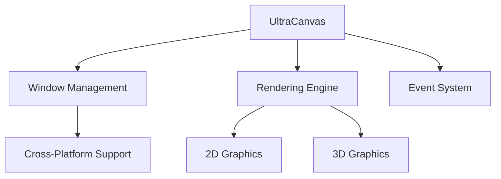

# UltraCanvas Markdown Demo
## Typography & Text Formatting

This document demonstrates the **complete range** of Markdown capabilities supported by UltraCanvas. You can use *italics*, **bold**, ***bold italics***, ~~strikethrough~~, and even `inline code`.

### Emphasis Examples

*This text is italicized*

**This text is bold**

***This text is bold and italic***

~~This text is crossed out~~

## Headings

# Heading 1
## Heading 2
### Heading 3
#### Heading 4
##### Heading 5
###### Heading 6

## Lists

### Unordered Lists

* First item
* Second item
  * Nested item 2.1
  * Nested item 2.2
    * Deep nested item 2.2.1
* Third item

Alternative syntax:

- Item A
- Item B
  - Nested B.1
  - Nested B.2

### Ordered Lists

1. First step
2. Second step
   1. Sub-step 2.1
   2. Sub-step 2.2
3. Third step

### Task Lists

- [x] Completed task
- [x] Another completed task
- [ ] Incomplete task
- [ ] Another incomplete task

## Links & Images

### Links

[UltraCanvas Framework](https://ultracanvas.example.com)

[Link with title](https://ultracanvas.example.com "UltraCanvas Homepage")

<https://autolink.example.com>

### Images


## Code Blocks

### Inline Code

Use the `UltraCanvas::CreateWindow()` function to initialize a new window.

### Fenced Code Blocks
```cpp
// UltraCanvas C++ Example
#include "UltraCanvasUI.h"

int main() {
    auto window = UltraCanvas::CreateWindow(800, 600, "Demo");
    window->Show();
    return UltraCanvas::RunEventLoop();
}
```
```python
# Python example
def create_ultracanvas_app():
    window = UltraCanvas.Window(800, 600)
    window.set_title("UltraCanvas Demo")
    window.show()
    return window
```
```javascript
// JavaScript example
const window = new UltraCanvas.Window({
    width: 800,
    height: 600,
    title: 'UltraCanvas Demo'
});
window.show();
```

## Blockquotes

> This is a blockquote.
> It can span multiple lines.

> Nested quotes are possible too:
> 
> > This is a nested quote
> > with multiple lines
>
> Back to the first level

> **Note:** UltraCanvas supports rich blockquote formatting with *emphasis* and `code`.

## Horizontal Rules

---

***

___

## Tables

| Feature | Windows | Linux | macOS | UltraOS |
|---------|---------|-------|-------|---------|
| Window Management | ✓ | ✓ | ✓ | ✓ |
| 2D Rendering | ✓ | ✓ | ✓ | ✓ |
| 3D Rendering | ✓ | ✓ | ✓ | ✓ |
| Audio Support | ✓ | ✓ | ✓ | ✓ |

| Component | Description | Status |
|:----------|:------------|-------:|
| TreeView | Hierarchical data display | Complete |
| DrawingSurface | 2D/3D rendering canvas | Complete |
| MarkdownViewer | Markdown rendering | In Progress |

### LayoutAlignment Examples

| Left Aligned | Center Aligned | Right Aligned |
|:-------------|:--------------:|--------------:|
| Left 1 | Center 1 | Right 1 |
| Left 2 | Center 2 | Right 2 |
| Left 3 | Center 3 | Right 3 |

## Advanced Formatting

### Definition Lists (if supported)

Term 1
: Definition of term 1

Term 2
: First definition of term 2
: Second definition of term 2

### Footnotes (if supported)

Here's a sentence with a footnote.[^1]

Another reference to a footnote.[^2]

[^1]: This is the first footnote content.
[^2]: This is the second footnote with more detailed information.

### Superscript & Subscript (if supported)

X^2^ + Y^2^ = Z^2^

H~2~O is water

### Abbreviations (if supported)

The HTML specification is maintained by the W3C.

*[HTML]: Hyper Text Markup Language
*[W3C]: World Wide Web Consortium

## Special Characters & Escaping

\*This text is surrounded by literal asterisks\*

\# This is not a heading

Backslash: \\

Backtick: \`

Asterisk: \*

Underscore: \_

## Emoji (if supported)

:smile: :heart: :rocket: :computer: :art:

## HTML Support (if enabled)

<div style="background-color: #f0f0f0; padding: 10px; border-radius: 5px;">
This is a <strong>custom HTML block</strong> with <em>inline styling</em>.
</div>

<kbd>Ctrl</kbd> + <kbd>C</kbd> to copy

<mark>Highlighted text</mark>

<details>
<summary>Click to expand</summary>

This content is hidden by default and revealed when clicked.

- Hidden item 1
- Hidden item 2
- Hidden item 3

</details>

## Complex Nested Structures

1. First ordered item
   - Nested unordered item
   - Another unordered item
     1. Nested ordered item
     2. Another nested ordered item
        - Deep nested unordered
        - Another deep nested
   - Back to second level
2. Second ordered item
   > With a blockquote
   > 
   > ```cpp
   > // And a code block
   > auto demo = CreateDemo();
   > ```
3. Third ordered item

## Mathematical Expressions (if LaTeX supported)

Inline math: $E = mc^2$

Block math:

$$
\int_{0}^{\infty} e^{-x^2} dx = \frac{\sqrt{\pi}}{2}
$$

$$
\sum_{n=1}^{\infty} \frac{1}{n^2} = \frac{\pi^2}{6}
$$

## Mermaid Diagrams (if supported)


## UltraCanvas Feature Matrix

| Category | Component | Description | Platforms |
|----------|-----------|-------------|-----------|
| **UI Controls** | Button | Interactive button with styling | All |
| **UI Controls** | Slider | Value adjustment control | All |
| **UI Controls** | TreeView | Hierarchical data display | All |
| **Rendering** | DrawingSurface | 2D/3D canvas | All |
| **Rendering** | ShapePrimitives | Basic geometric shapes | All |
| **Media** | ImageView | Image display with plugins | All |
| **Media** | AudioPlayer | Audio playback | All |
| **Text** | MarkdownViewer | Markdown rendering | All |

## Best Practices

### Code Organization

When working with UltraCanvas, follow these guidelines:

1. **Keep platform-specific code isolated**
   - Use `OS/Windows/`, `OS/Linux/`, `OS/MacOS/` directories
   - Implement same interfaces across platforms

2. **Use consistent naming**
   - PascalCase for classes: `UltraCanvasButton`
   - PascalCase for functions: `CreatePolygon()`
   - Clear, descriptive names

3. **Maintain version headers**
```cpp
   // UltraCanvasComponent.h
   // Component description
   // Version: 1.0.0
   // Last Modified: 2024-12-19
   // Author: UltraCanvas Framework
```

### Performance Tips

> **Important:** Always use GPU acceleration when available for optimal rendering performance.

* Enable double buffering for smooth animations
* Cache frequently used resources
* Use plugin system for format-specific optimizations

---

## Conclusion

This document demonstrates the full range of Markdown formatting capabilities supported by UltraCanvas. The framework's **MarkdownViewer** component provides comprehensive rendering of all standard Markdown features plus common extensions.

For more information, visit the [UltraCanvas Documentation](https://docs.ultracanvas.example.com).

---

**UltraCanvas Framework** | *Version 1.0* | © 2025
